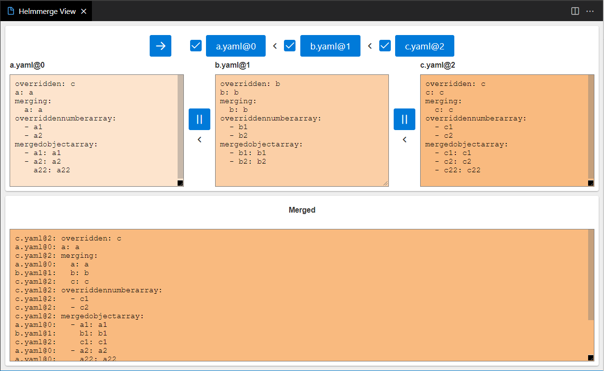
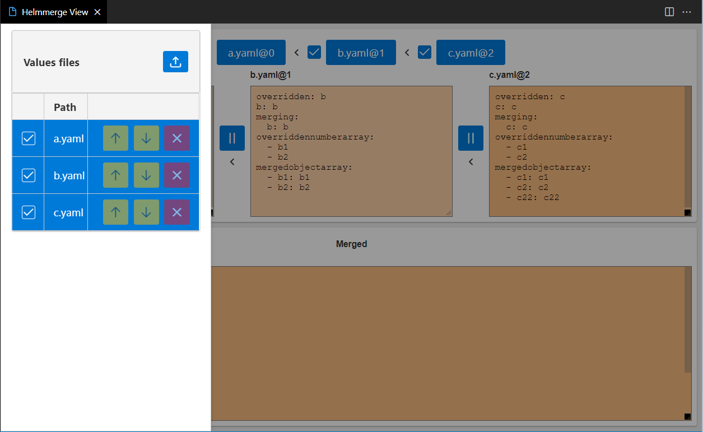

# Helmmerge Viewer based on VSCode Webview

A simple VSCode extension to visualize how Helm mergese various values files as described here: [Values files](https://helm.sh/docs/chart_template_guide/values_files/).

## Sample

# Known Issues

The overriders are not shown if the values file contain multiline values with |.
